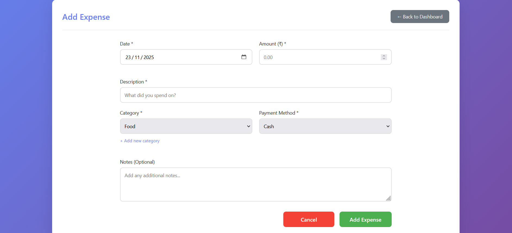
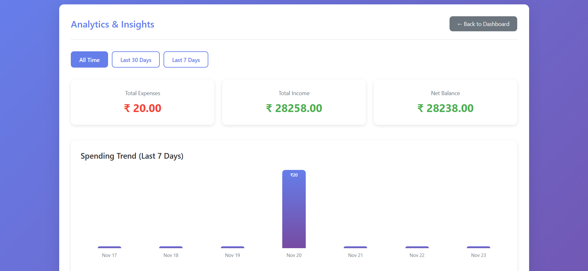

# Smart Expense Tracker

A comprehensive web application to manage your personal finances with budget alerts, analytics, and data export capabilities.

## Features

- **User Setup**: One-time setup to personalize your experience with your name and preferred currency
- **Expense Tracking**: Track expenses with detailed information (date, amount, description, category, payment method, notes)
- **Income Tracking**: Record income sources and amounts
- **Budget Management**: 
  - Set overall budgets or category-specific budgets
  - Choose weekly or monthly budget periods
  - Visual alerts when budget limits are exceeded
- **Category Management**: 
  - Predefined categories (Food, Transportation, Entertainment, Groceries, Miscellaneous)
  - Add custom categories based on your needs
- **Analytics & Insights**:
  - View spending trends over the last 7 days
  - Expenses breakdown by category
  - Payment method distribution
  - Weekly and monthly summaries
- **Transaction Management**: 
  - View all transactions in one place
  - Filter by type, category, payment method, date range, and search terms
  - Delete transactions
- **Data Export**: Export all your financial data to CSV format for backup or analysis
- **Responsive Design**: Works seamlessly on desktop, tablet, and mobile devices

## Tech Stack

- **React 19** - Frontend framework
- **Vite** - Build tool and development server
- **CSS3** - Pure CSS for styling (no CSS frameworks)
- **LocalStorage** - Client-side data persistence

## Installation

1. Clone the repository:
```bash
git clone https://github.com/yourusername/smart-expense-tracker.git
cd smart-expense-tracker
```

2. Install dependencies:
```bash
npm install
```

3. Start the development server:
```bash
npm run dev
```

4. Open your browser and navigate to `http://localhost:5173`

## Building for Production

To create a production build:
```bash
npm run build
```

The built files will be in the `dist` folder, which you can deploy to any static hosting service.

## Usage

1. **First Time Setup**: 
   - Enter your name and select your preferred currency
   - Click "Get Started"

2. **Welcome Screen**: 
   - You'll see a personalized welcome message
   - Click "Continue" to access the dashboard

3. **Dashboard**: 
   - View your net balance, total income, and total expenses
   - See weekly and monthly summaries
   - Quick actions to add expenses or income
   - View recent transactions

4. **Adding Expenses**:
   - Click "Add Expense" from the dashboard
   - Fill in the date, amount, description, category, payment method, and optional notes
   - Click "Add Expense" to save

5. **Adding Income**:
   - Click "Add Income" from the dashboard
   - Enter the date, amount, and description
   - Click "Add Income" to save

6. **Setting Budgets**:
   - Navigate to Budget Settings
   - Choose between overall budget or category-specific budgets
   - Select weekly or monthly period
   - Set your budget amounts
   - Save settings

7. **Managing Categories**:
   - Navigate to Categories
   - Add custom categories for your specific needs
   - Delete custom categories (default categories cannot be deleted)

8. **Viewing Analytics**:
   - Navigate to Analytics
   - Filter by time period (All Time, Last 30 Days, Last 7 Days)
   - View spending trends, category breakdowns, and payment method distribution

9. **Exporting Data**:
   - Navigate to Export
   - Review your data summary
   - Click "Export to CSV" to download your data

## Data Storage

All your data is stored locally in your browser's localStorage. This means:
- ✅ Your data stays private and on your device
- ✅ No internet connection required after initial load
- ✅ Fast and secure
- ❌ Data is device-specific (not synced across devices)
- ❌ Clearing browser data will delete your records

**Important**: Regularly export your data as a backup!

## Browser Compatibility

The app works on all modern browsers:
- Chrome/Edge (Recommended)
- Firefox
- Safari
- Opera

## Contributing

This is a personal finance tracker designed for individual use. If you'd like to contribute or suggest improvements:

1. Fork the repository
2. Create a feature branch (`git checkout -b feature/AmazingFeature`)
3. Commit your changes (`git commit -m 'Add some AmazingFeature'`)
4. Push to the branch (`git push origin feature/AmazingFeature`)
5. Open a Pull Request

## License

This project is open source and available under the [MIT License](LICENSE).

## Screenshots

### Dashboard


### Add Expense


### Analytics


## Support

If you encounter any issues or have questions, please open an issue on GitHub.

## Acknowledgments

- Built with React and Vite
- Icons: Unicode Emoji
- Inspired by the need for simple, privacy-focused financial tracking

---

**Made with ❤️ for better financial management**